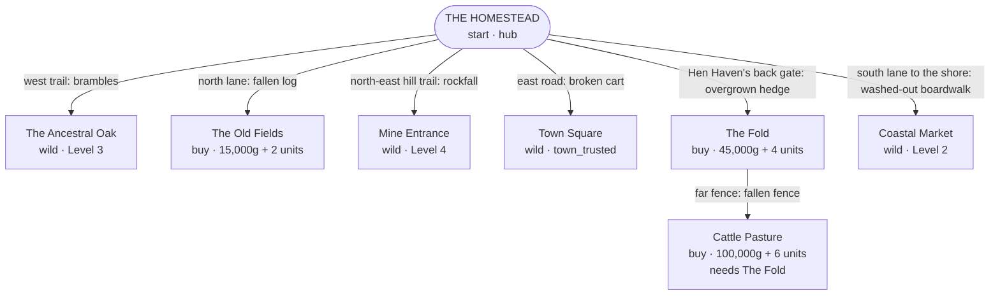

# StackAcres areas

Every place a player can visit in the top-down rewrite, how the places connect, and what
opens each one. Written 2026-09-16 and checked against the live code in
`lib/stackacres/` on that date. Map page: https://claude.ai/artifact/LFQwLCCQNfBTaku9CMnqov

**All eight areas are drawn** (2026-09-16, later the same day): every area at 2x with phone
views, the cast, and every sprite are on https://claude.ai/artifact/KBcywDhr8Q9tmdSviZmX4F.
Each area is `areas/rig/<name>.py` and renders to `areas/<name>/`. Kayo has not reviewed
the seven new areas yet; the Homestead was approved before its five edits.

## The two rules

1. **Areas are separate scenes, and the Homestead is the hub.** You walk off the edge of
   one area into the next, the way Stardew moves you from the farm to town.
2. **Every gate uses an unlock rule that already exists. No logic changes.**
   - **Land you buy** (The Old Fields, The Fold, Cattle Pasture): the gate *is* the claim
     point. Tapping the fallen log or the overgrown hedge offers the existing unlock, with the
     existing price.
   - **Wild land** (Town Square, Coastal Market, The Ancestral Oak, Mine Entrance) is never
     claimable in `sectors.ts`, only visitable. It opens when the **first traveler who lives
     there** unlocks, so nobody in the story is ever standing somewhere the player can't reach.
     The locked gate's hint can come straight from `storyUnlockHint` in `story/unlocks.ts`.

Story level means shop milestone count + 1 (`story/unlocks.ts`). The five milestone flags are
`crop_fields_unlocked`, `town_trusted`, `cleared_wallow`, `greenhouse_raised` and
`cleared_oxfields`, earned in any order. That's why no wild area may sit behind another
area's gate: Level 4 is reachable without `town_trusted`, so the Mine can't hide behind the
Town Square cart.

## Map

Geography: the Old Fields lie north, the Oak's woods west, the hills and mine north-east,
the town east along the farm road, and the Fold then the Pasture east past Hen Haven. The
coast is south, down the lane the player arrived on.

## Areas at a glance

| Area | Zone id | Proposed size | Gate you see | Opens when (existing rule) | Travelers there |
|---|---|---|---|---|---|
| The Homestead | `farmstead` + `henhaven` | 44×32 (drawn) | none | always, both `home` sectors | Ray (always), Pierre (L2), Ivy (L4) |
| The Old Fields | Crop Fields flag | ~40×30 | fallen log, north lane | `crop_fields_unlocked`: 15,000g + 2 units (`crop-fields.ts`) | none |
| The Fold | `wallow` | ~28×22 | overgrown hedge behind Hen Haven | `cleared_wallow`: 45,000g + 4 units (`sectors.ts`) | none |
| Cattle Pasture | `oxfields` | ~36×26 | fallen fence at the Fold's far side | `cleared_oxfields`: 100,000g + 6 units, requires the Fold | Wes (`cleared_oxfields`) |
| Coastal Market | `coast` | ~40×22 | washed-out boardwalk, south | Level 2 (Miles) | Miles (L2), Barnaby (L3) |
| The Ancestral Oak | `oak` | ~32×28 | brambles on the west trail | Level 3 (Skye) | Skye (L3), Bea (L5) |
| Mine Entrance | `mine` | ~28×22 | rockfall on the north-east trail | Level 4 (Brayden) | Brayden (L4) |
| Town Square | `townsquare` | ~36×26 | broken cart, east road | `town_trusted` (Arthur) | Arthur (`town_trusted`), Leo (finale: all 10 others home) |

Traveler zones and unlocks are in `lib/stackacres/story/travelers.ts`; sector prices and
states in `lib/stackacres/sectors.ts`; zone display names in `lib/stackacres/zones.ts`.

## Each area

### The Homestead (start, hub)
Ray's land in East Preston. Drawn: `homestead/homestead.png`, review page
https://claude.ai/artifact/KKdRejByajLnJELNBP1j7x
- **Buildings you enter:** Ray's House, the Barn, the Old Mill, and the Greenhouse once raised (see Interiors).
- **Outdoors:** two crop beds (88 tillable tiles), Hen Haven's pen and coop, and the pond and dock for fishing (existing `catch-fish`).
- **Secrets:** all three from `secrets.ts` are placed: the well, the loose board by the barn, and the jammed gear on the mill.
- **People and objects:** the Pixel Pilgrim by the pond (not drawn yet) and the Town Contracts board at the signpost, reachable from day one exactly as contracts are today.
- **Crossbreeding Bed:** outdoors near the greenhouse footing. Not inside the greenhouse, because that would gate it behind `greenhouse_raised`, which is a logic change.

### The Old Fields
The big crop field, deliberately not in the starting area. Its own scene past the fallen log.
Tapping the log offers the existing Crop Fields unlock. Ray's third quest line already fits:
*"The old fields have gone to bush since I passed. Clear one of them back."*

### The Fold, then Cattle Pasture
Chained east past Hen Haven, which puts the existing dependency (Pasture requires the Fold) on
the ground. The Fold becomes the Sheep Pens and the Pasture the Cattle Pens (each sector's
`promise` text). Both pens are where bear-defense fights happen when predators reach livestock
(`wildlife.ts` decides when; the fight is presentation).

### Coastal Market
*"One day: market stalls on the shore, and a dock to work from."* Stalls and a real dock. Miles
investigates here and Barnaby dives. Fishing stays at the Homestead pond unless new catches are
added, which would be new logic.

### The Ancestral Oak
*"Something old stands here."* A clearing around one enormous tree, with Skye's mural and
Bea's hives. Its forest edge is the natural source of bears.

### Mine Entrance
*"A way in, and nothing on the other side of it yet."* A cave mouth in the north-east hills,
Brayden's camp, and room for a mine to go down into later.

### Town Square
*"One day: the town itself, instead of a board you post to."* The second Town Contracts board,
Arthur's post, and the stage for Leo's beacon: the finale.

## Interiors

| Building | Area | What's inside (existing systems) |
|---|---|---|
| Your House | Homestead | the kitchen: cooking, eating, the Preserves Cellar and the Farm Kitchen (`stackacres-house.tsx`). Ray is a separate character; tapping him opens his story or gifts |
| The Barn | Homestead | Supply Store (Ray's shop) |
| The Old Mill | Homestead | Workshop machines (Mill, Dairy, Loom, Fermenting Vat) and the Sunlight Forge |
| The Greenhouse | Homestead | the 6-slot greenhouse grid, enterable once `greenhouse_raised` |

The Sunlight Forge stays at the Homestead because nothing in the code gates it by level.
Moving it to Mine Entrance would lock it behind Level 4, which is a logic change.

## Changes made to the drawn Homestead to match this map (all done 2026-09-16)
1. **West forest trail** exit (to the Oak), with brambles, at rows 12-13 off Ray's apron.
2. **North-east hill trail** exit east along the greenhouse footing then north at column 42
   (to the Mine), with rockfall in the corner.
3. **Back gate** in Hen Haven's east fence (to the Fold): the fence is split around a 2-tile
   gap and an overgrown hedge fills it; a path stub runs east to the edge.
4. **South lane** is the shore road: the washed-out boardwalk sits across it at the south
   edge. The dock is a fishing spot only (the earlier "no boat yet" idea is dropped).
5. **Pixel Pilgrim** on the pond's south-west bank (where `monk.ts` puts him), and Pierre and
   Ivy standing in the farmstead. Ray is drawn as himself (not a spirit: Kayo's call).
6. **The stream** (Kayo asked for streams and waterfalls): out of the north-west woods, down
   the west side under a plank bridge on the west trail (the brambles sit just past it),
   into the pond, and out of the pond south to the shore. The west bed moved one tile east
   to make room. It continues on the Coastal Market map, across the beach into the sea. The
   Mine has a waterfall off the rock face into a plunge pool and a stream south.

## Where each traveler stands in the renders
Pierre by the signpost and Ivy by the greenhouse footing (Homestead); Wes at the pasture
gate; Miles by the stalls and Barnaby out on the pier; Skye at her mural and Bea by her
hives; Brayden between his tent and the spoil apron; Arthur by the contracts board and Leo
by the beacon. All of them are rig characters with the full animation set.

## Open decisions for Kayo
- **Old Fields gate:** keep the existing 15,000g purchase (no logic change, and what is
  drawn), or gate it on Ray's quest line as you first suggested (a logic change to
  `crop-fields.ts`).
- **Area sizes** are drawn at the proposals above, sized against Stardew (farm maps, the
  120-tile greenhouse, Ginger Island's 876 tillable tiles). Any can change; the rigs regenerate.
